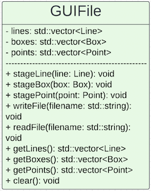

# Irish-Solutions-Inc
### FA24-CSE-40232-01 Software Engineering

# GUIFile

The `GUIFile` class is responsible for managing GUI elements like `Line`, `Box`, and `Point`. It provides functionality to stage, store, and write these elements to an XML file format. Additionally, it can read elements from an XML file and reconstruct them within the class. The class uses `std::vector` containers to store the elements.

## Public Methods

### stageLine
This method stages a `Line` object to be stored in the class.

- **Arguments**: 
  - `const Line& line`: The `Line` object containing a start position (`vec2`), end position (`vec2`), and color (`vec3`).
  
- **Behavior**: Adds the given `Line` object to the `lines` container.
  
- **Return**: None.

### stageBox
This method stages a `Box` object to be stored in the class.

- **Arguments**: 
  - `const Box& box`: The `Box` object containing minimum and maximum bounds (`vec2`) and a color (`vec3`).
  
- **Behavior**: Adds the given `Box` object to the `boxes` container.
  
- **Return**: None.

### stagePoint
This method stages a `Point` object to be stored in the class.

- **Arguments**: 
  - `const Point& point`: The `Point` object containing a position (`vec2`) and a color (`vec3`).
  
- **Behavior**: Adds the given `Point` object to the `points` container.
  
- **Return**: None.

### writeFile
Writes all stored GUI elements (lines, boxes, and points) into an XML file.

- **Arguments**:
  - `const std::string& filename`: The name of the file where the data will be written.

- **Behavior**: 
  - Opens a file and writes the GUI elements in the following format:
    - `<line>` for each line, including start position, end position, and color.
    - `<box>` for each box, including minimum bounds, maximum bounds, and color.
    - `<point>` for each point, including position and color.
    
  - If the file cannot be opened for writing, an error message is displayed.

- **Return**: None.

### readFile
Reads and parses an XML file, extracting GUI elements (lines, boxes, points) into the class.

- **Arguments**:
  - `const std::string& filename`: The name of the file to read.

- **Behavior**: 
  - Reads the XML file line by line, identifying `<line>`, `<box>`, and `<point>` tags.
  - For each element, it extracts the necessary `vec2` and `vec3` data and stores it in the respective container (`lines`, `boxes`, or `points`).
  - If the file cannot be opened for reading, an error message is displayed.

- **Return**: None.

### getLines
Retrieves the stored lines.

- **Arguments**: None.

- **Behavior**: Returns the `lines` container, which holds all staged `Line` objects.

- **Return**: `std::vector<Line>` containing all stored lines.

### getBoxes
Retrieves the stored boxes.

- **Arguments**: None.

- **Behavior**: Returns the `boxes` container, which holds all staged `Box` objects.

- **Return**: `std::vector<Box>` containing all stored boxes.

### getPoints
Retrieves the stored points.

- **Arguments**: None.

- **Behavior**: Returns the `points` container, which holds all staged `Point` objects.

- **Return**: `std::vector<Point>` containing all stored points.

### clear
Clears all staged elements from the class.

- **Arguments**: None.

- **Behavior**: Clears the `lines`, `boxes`, and `points` containers.

- **Return**: None.

## Container Choices

The class uses `std::vector` containers to store the GUI elements (`Line`, `Box`, `Point`). This choice is driven by the following considerations:

- **Dynamic Sizing**: `std::vector` allows for dynamic resizing, making it suitable for managing a variable number of GUI elements.
- **Efficient Access**: `std::vector` provides efficient random access, allowing the elements to be accessed in constant time.
- **Ease of Iteration**: `std::vector` supports iteration through elements, which is useful when writing or reading elements to/from a file.

### Containers Used:
- `std::vector<Line> lines`: Stores all `Line` objects.
- `std::vector<Box> boxes`: Stores all `Box` objects.
- `std::vector<Point> points`: Stores all `Point` objects.
